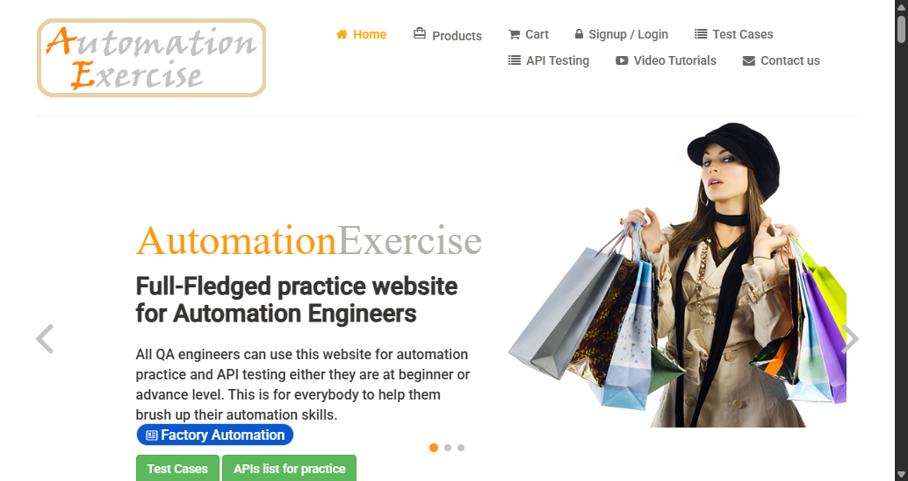

# Selenium WebDriver Practice

A hands-on **QA automation practice project** built with Selenium WebDriver and JavaScript.

This repository documents my practice with browser automation using Selenium WebDriver, including navigation, element interaction, explicit waits, URL verification, page assertions, and screenshot capture.

The project is part of my ongoing learning as I build practical experience across different browser automation tools.

## What I'm Testing

### Navigation Test

**File:** `test.js`

The navigation test:

* Loads the practice website
* Waits for the Products link to become available
* Clicks the Products link
* Verifies the resulting URL
* Verifies the expected page heading

### Screenshot Test

**File:** `screenshot.js`

The screenshot test:

* Opens the homepage
* Captures a screenshot
* Saves the screenshot to:

```text
screenshots/homepage.png
```

Selenium WebDriver provides screenshot functionality through `takeScreenshot()`.

## Testing Skills Practiced

Through this project, I am practicing:

* Browser automation
* Page navigation
* Element location
* Element interaction
* Explicit waits
* URL verification
* Page content assertions
* Screenshot capture
* Browser session management
* Test execution from the command line

## Explicit Waits

One of the concepts I am practicing with Selenium is synchronization.

Instead of relying only on fixed delays, the tests use Selenium's `driver.wait()` functionality to wait for a specific condition before continuing.

This is important when working with web applications where elements may appear or become interactive after the initial page load. Selenium's documentation recommends condition-based waiting strategies for handling these synchronization challenges.

Example:

```javascript
await driver.wait(
  until.elementLocated(By.linkText("Products")),
  10000
);
```

## Tech Stack

* **Selenium WebDriver**
* **JavaScript**
* **Node.js**
* **npm**
* **Chrome**

## Sample Screenshot



## How This Project Differs From My Other Automation Practice

I am using different browser automation tools to understand their approaches to automated testing.

### Cypress

My Cypress project focuses on:

* Functional UI testing
* Login flows
* Navigation
* Assertions
* API testing practice

### Playwright

My Playwright project focuses on:

* End-to-end testing
* Cross-browser execution
* Chromium, Firefox, and WebKit
* Locators and assertions
* Screenshots and reporting

### Selenium

This project focuses on:

* WebDriver fundamentals
* Browser session management
* Explicit waits
* Element interaction
* Navigation and verification
* Command-line test execution

The purpose of these projects is to build hands-on familiarity with different automation approaches rather than to present myself as an expert in each framework.

## How to Run the Tests

### 1. Clone the repository

```bash
git clone <your-repository-url>
cd <repository-folder>
```

### 2. Install dependencies

```bash
npm install
```

### 3. Run the navigation test

```bash
node test.js
```

### 4. Run the screenshot test

```bash
node screenshot.js
```

## Project Structure

```text
selenium-webdriver-practice/
├── screenshots/
│   └── homepage.png
├── test.js
├── screenshot.js
├── package.json
└── README.md
```

> Update the structure above if your actual repository contains different files or folders.

## Project Status

**Active learning project**

I am continuing to improve the test scenarios and develop my understanding of Selenium WebDriver, synchronization, browser interactions, assertions, and test organization.

## Planned Improvements

* Add additional navigation scenarios
* Add positive and negative test cases
* Add more element interaction scenarios
* Improve locator strategies
* Practice reusable helper functions
* Explore Page Object Model concepts
* Add more browser coverage
* Explore automated test reporting
* Explore CI execution

## About Me

I am a **Junior QA & Integration Developer** building practical skills in software testing, test automation, integrations, and workflow automation.

I use projects like this to practice new tools, document my learning, and gradually build stronger hands-on experience in QA automation.
